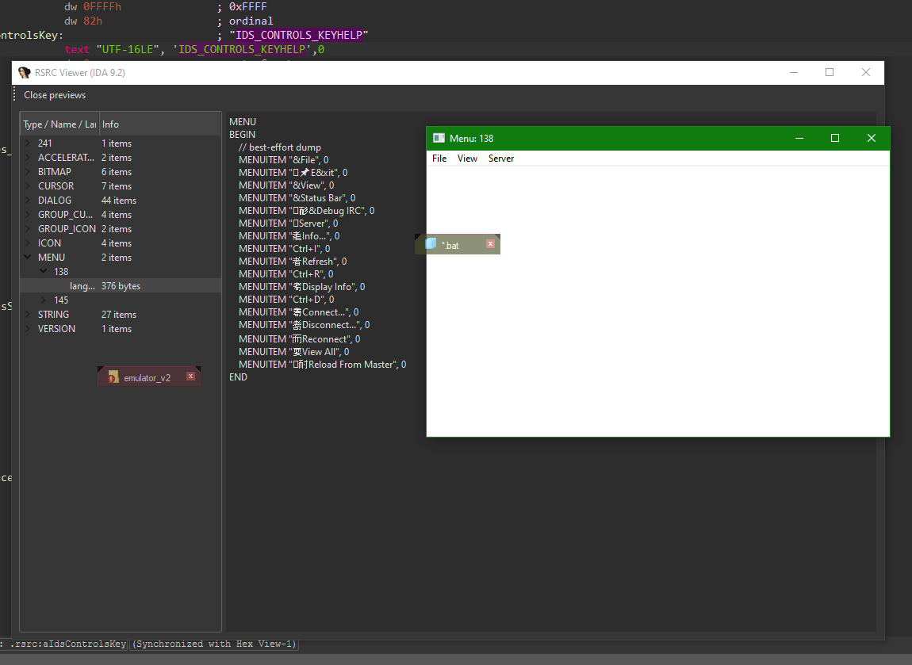
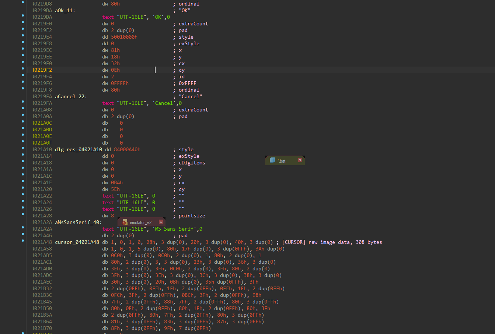

# IDA Resource Tools

This repository contains two complementary IDA Pro 9.2 scripts for working with the `.rsrc` section of Windows PE binaries.  
Together, they allow both **formatting and visualization** of Windows resources directly inside IDA.

> Can be run as either a Python script within IDA or as a plugin.

---

## 🔎 Previews

  
  &nbsp;&nbsp;&nbsp;
  

- Click either thumbnail to open the full-size image.

---

## 🧠 Scripts Overview

### `format_rsrc.py`
An **IDA in-database formatter** that dissects and annotates the `.rsrc` section in PE files.  
It identifies resource directories, names, and data entries, applying type-aware parsing for common resource types such as dialogs, menus, icons, cursors, and version information.

**Key features**
- Walks the `.rsrc` tree recursively and adds structure names and comments.  
- Recognizes standard resource types (`DIALOG`, `MENU`, `STRING`, `VERSION`, `ICON`, etc.).  
- Creates IDA string literals, defines words/dwords, and sets readable labels for each entry.  
- Annotates version info blocks, dialog templates, and accelerator tables.  
- Requires no external dependencies—runs entirely inside IDA using its native modules (`ida_bytes`, `ida_segment`, `ida_kernwin`, etc.).

---

### `resource_viewer.py`
A **PySide6-based resource browser and previewer**.  
It scans the parsed `.rsrc` section and displays a navigable tree of resource entries, allowing interactive previews of embedded icons, cursors, bitmaps, dialogs, and menus.

**Key features**
- PySide6 GUI for interactive viewing.  
- Previews icons and cursors (legacy monochrome and PNG/DIB formats).  
- Displays dialogs and menus using live Win32 previews.  
- Decodes version info, accelerators, and string tables.  
- Integrates with IDA logging and runs as script or plugin (`run()` entry point).  
- Depends on `PySide6` and optionally `Pillow` for image handling.

---

## ⚙️ Installation

**Requirements**

Each script includes its own `requirements.txt`  
- `format_rsrc.py` → no external dependencies  
- `resource_viewer.py` → requires `PySide6` and `Pillow`

Install them with IDA’s bundled Python:

    python -m pip install -r requirements.txt

**Plugin setup (optional)**  
1. Place the scripts in IDA’s `plugins/` directory.  
2. Restart IDA—the plugin appears in the Plugins menu.

---

## 🧩 Example Workflow
1. Run `format_rsrc.py` in IDA to annotate the `.rsrc` tree.  
2. Launch `resource_viewer.py` to browse and preview icons, dialogs, and other resource items.

---

## 📄 License
Use freely at your own risk. These scripts interact directly with PE resource structures inside IDA; quirks with malformed binaries or odd encodings are your problem.

